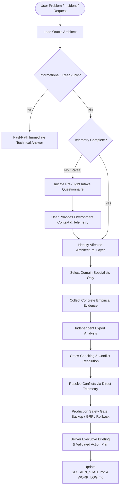

<p align="center">
  
</p>

<h1 align="center">Oracle ERP &amp; Database Center of Excellence (CoE)</h1>

<p align="center">
  <strong>Techwaves EGY</strong> — <em>SOLUTIONS • INNOVATION • SUCCESS</em><br/>
  Contact: <a href="mailto:info@techwaves-egy.com">info@techwaves-egy.com</a>
</p>

<p align="center">
  <a href="https://www.oracle.com/applications/ebs/"></a>
  <a href="https://www.oracle.com/database/"></a>
  <a href="#-the-27-expert-council"></a>
  <a href="#-universal-agent-installation--setup"></a>
  <a href="EULA.md"></a>
</p>

An enterprise-grade, multi-agent AI skill and operational framework designed to manage, troubleshoot, optimize, patch, upgrade, migrate, and automate **Oracle E-Business Suite (R12.1.3 / R12.2.x)** and **Oracle Database (11g / 12c / 19c / 23ai)** across high-availability architectures (RAC, ASM, Data Guard, Exadata, and OCI Cloud).

---

## 🏛️ Architecture & Operating Model

The framework operates as a synchronized **Center of Excellence (CoE)** led by the **Lead Oracle Architect** and supported by **27 specialized senior domain experts**. Rather than treating the enterprise ERP as a black box, every incident is investigated systematically through the complete 9-layer technology stack:

```
[ Layer 1: Client / Browser / Java Web Start (JWS) / SSL Handshake ]
                                  ↓
       [ Layer 2: Network / DNS / Load Balancer (F5 VIP / Routing) ]
                                  ↓
                 [ Layer 3: Web Tier (OHS / Apache / mod_wl_ohs) ]
                                  ↓
    [ Layer 4: WebLogic Managed Servers (oacore, forms, oafm, JDBC Pools) ]
                                  ↓
      [ Layer 5: EBS Core Services (Concurrent Managers, Workflow Engine) ]
                                  ↓
     [ Layer 6: Oracle Database (SGA/PGA, Enqueues, Latches, SQL Engine) ]
                                  ↓
     [ Layer 7: High Availability & Clustering (RAC Interconnect, VIPs) ]
                                  ↓
   [ Layer 8: Storage & Automatic Storage Management (ASM Disk Groups) ]
                                  ↓
        [ Layer 9: Operating System (Oracle Linux / RHEL / HugePages / I/O) ]
```



---

## 👥 The 27-Expert Council

| ID | Expert Role | Primary Domain & Responsibilities |
|:---|:---|:---|
| **00** | **Lead Oracle Architect** | Orchestrator, multi-tier layer triage, cross-expert coordination & risk gatekeeper |
| **01** | **Oracle EBS Architect** | EBS R12.1/R12.2 architecture, APPL_TOP/INST_TOP, context files, login pipelines |
| **02** | **EBS System Administrator** | Service control (`adstrtal`/`adstpall`), ports, env files, application filesystem |
| **03** | **Oracle Database DBA** | Core RDBMS (11g–23ai), SGA/PGA, tablespaces, UNDO/TEMP, Redo/Archive logs |
| **04** | **SQL / PL/SQL Expert** | Execution plans, SQL profiles/baselines, custom packages, EBS data integrity |
| **05** | **Oracle Performance Engineer** | AWR, ASH, ADDM, SQL Monitor, wait events, latch/mutex/lock contention |
| **06** | **RAC / Grid / ASM Architect** | Oracle RAC, Grid Infrastructure (`crsctl`/`srvctl`), ASM disk groups (`asmcmd`) |
| **07** | **RMAN Backup & Recovery Expert** | Enterprise backup strategy, restore validation, PITR, block corruption recovery |
| **08** | **Data Guard / DR Expert** | Physical standby, MRP/RFS sync, Data Guard Broker (`dgmgrl`), switchover/failover |
| **09** | **WebLogic Expert** | AdminServer, Managed Servers (`oacore`, `forms`), JVM heap/GC, OutOfMemory |
| **10** | **Forms & Reports Expert** | Forms Listener Servlet, `frmweb` processes, Reports Server, FRM/REP error triage |
| **11** | **Concurrent Processing Expert** | ICM, Standard Manager, CRM, work shifts, queue backlog & long-running requests |
| **12** | **Workflow Expert** | Workflow Engine, Background Process, Notification Mailer, `WF_DEFERRED` queues |
| **13** | **ADOP / Patching Expert** | EBS 12.2 Online Patching (`fs1`/`fs2`/`fs_ne`), cycle phases, `AD_ZD` editioning |
| **14** | **AutoConfig Expert** | Context XML files, templates, driver files, dual-fs autoconfig synchronization |
| **15** | **Oracle Linux Expert** | OS health, HugePages, kernel tuning (`sysctl.conf`), memory, CPU & I/O triage |
| **16** | **Linux Security Expert** | CIS hardening, SELinux enforcement, SSH security, sudoers, OS audit & firewall |
| **17** | **Storage Expert** | SAN/NAS/NFS, DM-Multipath, disk service times/latencies, filesystem full triage |
| **18** | **Network Engineer** | TCP/IP, DNS latency, MTU, load balancer VIPs, firewalls, network packet traces |
| **19** | **Integration Engineer** | REST/SOAP APIs, ISG (Integrated SOA Gateway), XML Gateway, DB Links |
| **20** | **SFTP Expert** | OpenSSH SFTP daemon, chroot jails, SSH keys, automated batch ingestion |
| **21** | **Oracle Security Architect** | Database/EBS security, TDE, TLS/SSL certificates, auditing, least privilege |
| **22** | **Monitoring Engineer** | OEM Cloud Control 13c, Prometheus, Grafana, alerting & metric baselines |
| **23** | **Capacity Planning Expert** | Database growth models, tablespace exhaustion forecasting, sizing analysis |
| **24** | **Automation / Ansible Expert** | Ansible Playbooks, Python, Bash automation, idempotent maintenance scripts |
| **25** | **Incident Response / RCA Expert** | Major incident containment, timeline reconstruction, 5-Whys, formal RCA reports |
| **26** | **Change Management Expert** | Risk assessment (Low/Med/High/Critical), CAB documentation, rollback planning |
| **27** | **Business Continuity Architect** | Enterprise RTO/RPO alignment, disaster recovery plans, critical path sequencing |

---

## ⚡ Key Capabilities & Features

1. **Mandatory Pre-Flight Intake Protocol (Ask Before Start)**: Prevents blind assumptions by collecting essential environment details, error codes, and scope before recommending state changes.
2. **21 Production Standard Operating Playbooks**: Complete step-by-step diagnostic and remediation runbooks covering everything from database hangs to zero-data-loss Data Guard switchovers.
3. **End-to-End Implementation Engine**: Fully capable of generating PL/SQL workflow packages, automated concurrent program registrations (`FND_PROGRAM`), BI Publisher data templates, and shell routines.
4. **Version Upgrades & Cloud Migration**: Standardized pathways for AutoUpgrade 19c/23ai, EBS 12.2 Edition-Based Redefinition (EBR / `AD_ZD`), RMAN Cross-Platform Transportable Tablespaces (XTTS v4), and Non-CDB to PDB conversion.
5. **Persistent History & Inter-Agent Handover**: Maintains live state in `docs/SESSION_STATE.md` and chronological audit history in `docs/WORK_LOG.md` so multiple agents or sessions collaborate seamlessly without re-asking questions.
6. **Zero Credential Exposure & Safety Gates**: Automatic token masking for sensitive credentials and mandatory backup/GRP/rollback verification prior to execution.

---

## 💻 Universal Agent Installation & Setup

This repository is designed to be **agent-agnostic** and works out-of-the-box across all major AI developer tools:

### Option A: Google Antigravity & Gemini Code Assist
1. Clone or copy this repository into your workspace:
   ```bash
   git clone https://github.com/Techwaves-egy/oracle-erp-database-expert.git
   ```
2. Open the folder in Antigravity or Gemini Code Assist.
3. The framework is automatically discovered via [AGENTS.md](AGENTS.md), [GEMINI.md](GEMINI.md), and `.agents/skills/`.

### Option B: Anthropic Claude Code (CLI) & Claude Desktop
* **Claude Code CLI**: Run `claude` inside this directory. Claude will automatically read [CLAUDE.md](CLAUDE.md).
* **Claude Desktop Projects**: Create a new Project, set the contents of [prompts/SYSTEM_PROMPT.md](prompts/SYSTEM_PROMPT.md) as Project Custom Instructions, and attach this repository as Project Knowledge files.

### Option C: Cursor IDE
1. Open this repository folder in Cursor.
2. The rules in [.cursorrules](.cursorrules) are automatically injected into Cursor Chat and Composer sessions.

### Option D: Windsurf IDE (Codeium Cascade)
1. Open this repository folder in Windsurf.
2. The rules in [.windsurfrules](.windsurfrules) are automatically loaded by Cascade.

### Option E: OpenAI ChatGPT, Custom GPTs & Assistants API
1. Create a Custom GPT or Assistant.
2. Paste [prompts/SYSTEM_PROMPT.md](prompts/SYSTEM_PROMPT.md) into the **Instructions / System Message** field.
3. Upload `playbooks/`, `templates/`, and `scripts/` as Knowledge Base files.

### Option F: Custom Agent Frameworks (LangChain, AutoGen, CrewAI)
1. Set the system prompt using [prompts/SYSTEM_PROMPT.md](prompts/SYSTEM_PROMPT.md).
2. Register diagnostic scripts in `scripts/sql/` and `scripts/shell/` as agent tools.
3. Bind session state tracking to `docs/SESSION_STATE.md` and `docs/WORK_LOG.md`.

---

## 📚 Master Playbook Matrix (00–21)

| Playbook | Title | Direct Link | Primary Scope |
|:---|:---|:---|:---|
| **PB-00** | Intake & Discovery | [00_intake_and_discovery.md](playbooks/00_intake_and_discovery.md) | Pre-flight discovery checklist & questionnaires |
| **PB-01** | Full Health Check | [01_health_check.md](playbooks/01_health_check.md) | Full 9-layer ERP and database health audit |
| **PB-02** | EBS Login Failures | [02_ebs_login_failures.md](playbooks/02_ebs_login_failures.md) | 500/502 Bad Gateway, FRM-92101, OHS & WLS triage |
| **PB-03** | Database Hang & Locks | [03_database_hang_and_locks.md](playbooks/03_database_hang_and_locks.md) | Blocking lock trees, 100% CPU, controlled termination |
| **PB-04** | Month-End Closing | [04_month_end_performance.md](playbooks/04_month_end_performance.md) | Concurrent queue delays, TEMP/UNDO, AWR diffs |
| **PB-05** | RMAN Backup & Recovery | [05_rman_backup_recovery.md](playbooks/05_rman_backup_recovery.md) | ORA-19809 (FRA full), restore validation, recovery |
| **PB-06** | ADOP Online Patching | [06_adop_online_patching.md](playbooks/06_adop_online_patching.md) | Dual-FS ADOP cycle (`prepare` -> `cutover` -> `cleanup`) |
| **PB-07** | Custom Workflow | [07_workflow_development.md](playbooks/07_workflow_development.md) | PL/SQL activity packages, WFLOAD, BES events |
| **PB-08** | BI Publisher Reports | [08_bi_publisher_reports.md](playbooks/08_bi_publisher_reports.md) | XML Data Templates, RTF, XDOLoader, Bursting |
| **PB-09** | Database 19c Upgrade | [09_database_upgrade_19c_autoupgrade.md](playbooks/09_database_upgrade_19c_autoupgrade.md) | AutoUpgrade tool, GRP fallback, timezone fixups |
| **PB-10** | EBS 12.2 Upgrade & CEMLI | [10_ebs_r12_2_upgrade_and_cemli.md](playbooks/10_ebs_r12_2_upgrade_and_cemli.md) | 12.1 to 12.2 upgrade, CEMLI EBR (`AD_ZD`) standards |
| **PB-11** | Cross-Platform / Cloud | [11_cross_platform_cloud_migration_xtts.md](playbooks/11_cross_platform_cloud_migration_xtts.md) | RMAN XTTS v4 cross-endian & OCI migration |
| **PB-12** | Non-CDB to PDB | [12_noncdb_to_pdb_conversion.md](playbooks/12_noncdb_to_pdb_conversion.md) | Multitenant conversion via `DBMS_PDB.DESCRIBE` |
| **PB-13** | Data Guard Switchover | [13_dataguard_switchover_failover.md](playbooks/13_dataguard_switchover_failover.md) | Zero-data-loss switchover and DR failover |
| **PB-14** | Listener / TNS Triage | [14_listener_tns_connectivity.md](playbooks/14_listener_tns_connectivity.md) | ORA-12541, ORA-12514, SCAN listener registration |
| **PB-15** | RAC Node Eviction | [15_rac_interconnect_node_eviction.md](playbooks/15_rac_interconnect_node_eviction.md) | CSS misscount, voting disk timeout, packet loss |
| **PB-16** | ASM Disk Group Mgmt | [16_asm_diskgroup_rebalance_expansion.md](playbooks/16_asm_diskgroup_rebalance_expansion.md) | Disk group full, rebalance power, disk add/drop |
| **PB-17** | Tablespace Expansion | [17_tablespace_emergency_expansion.md](playbooks/17_tablespace_emergency_expansion.md) | ORA-01653/1654, autoextend headroom, bigfile resize |
| **PB-18** | Workflow Mailer Fix | [18_workflow_mailer_deferred_queue.md](playbooks/18_workflow_mailer_deferred_queue.md) | Notification Mailer failure, WF_DEFERRED backlog |
| **PB-19** | AutoConfig Rebuild | [19_autoconfig_failure_context_rebuild.md](playbooks/19_autoconfig_failure_context_rebuild.md) | AC-50480, context XML rebuild from templates |
| **PB-20** | Alert Log ORA- Triage | [20_alert_log_ora_error_triage.md](playbooks/20_alert_log_ora_error_triage.md) | ORA-00600, ORA-07445, ORA-04031, ORA-01555 |
| **PB-21** | Agent State Handover | [21_agent_handover_and_state_tracking.md](playbooks/21_agent_handover_and_state_tracking.md) | Inter-agent state synchronization & backlog updates |

---

## 🛠️ Specialized Script Library

### Diagnostic SQL Scripts (`scripts/sql/`)
* [`ebs_full_health_check.sql`](scripts/sql/ebs_full_health_check.sql) — Non-destructive complete database and EBS health audit.
* [`session_diagnostics.sql`](scripts/sql/session_diagnostics.sql) — Active sessions, wait events, and blocking lock tree.
* [`awr_top_sql.sql`](scripts/sql/awr_top_sql.sql) — Top SQL from ASH (last 60m) and cursor cache.
* [`undo_temp_usage.sql`](scripts/sql/undo_temp_usage.sql) — Real-time session TEMP consumption and UNDO retention stats.
* [`rac_interconnect_stats.sql`](scripts/sql/rac_interconnect_stats.sql) — Global cache wait events and lost blocks.
* [`data_guard_lag.sql`](scripts/sql/data_guard_lag.sql) — Standby MRP status, transport lag, apply lag, and archive gaps.
* [`tablespace_growth_forecast.sql`](scripts/sql/tablespace_growth_forecast.sql) — Autoextend limits and allocated free space.
* [`invalid_objects_report.sql`](scripts/sql/invalid_objects_report.sql) — Schema invalid objects count and APPS list.
* [`security_privilege_audit.sql`](scripts/sql/security_privilege_audit.sql) — DBA roles, `ANY` privileges, and default profiles.
* [`rman_backup_validation.sql`](scripts/sql/rman_backup_validation.sql) — 14-day backup history and FRA breakdown.
* [`concurrent_manager_triage.sql`](scripts/sql/concurrent_manager_triage.sql) — Manager queue loads and long-running requests.

### Management Shell Scripts (`scripts/shell/`)
* [`ebs_services_status.sh`](scripts/shell/ebs_services_status.sh) — Single-pass status check across all EBS tiers.
* [`ebs_services_start.sh`](scripts/shell/ebs_services_start.sh) — Ordered safe startup sequence (DB -> WLS -> OHS -> CM).
* [`ebs_services_stop.sh`](scripts/shell/ebs_services_stop.sh) — Ordered graceful shutdown sequence.
* [`os_health_check.sh`](scripts/shell/os_health_check.sh) — CPU, HugePages, load average, disk I/O, and memory paging.
* [`asm_disk_group_check.sh`](scripts/shell/asm_disk_group_check.sh) — Disk group free space and rebalance operations (`asmcmd`).
* [`archive_log_cleanup.sh`](scripts/shell/archive_log_cleanup.sh) — Safe verified RMAN archive log cleanup.
* [`adop_phase_runner.sh`](scripts/shell/adop_phase_runner.sh) — ADOP phase execution wrapper with disk space checks.

---

## 🔒 Production Safety Gate Standards

Before any state-altering remediation is executed on production systems:
1. **Target Verification**: Target Hostname, DB SID, Instance ID, and EBS environment (`PROD`/`TEST`) must be confirmed.
2. **Backup Status**: Verified valid RMAN full/incremental backup within SLA.
3. **Rollback Guarantee**: Step-by-step reversible commands documented.
4. **Non-Destructive First**: Follow `READ` → `ANALYZE` → `VALIDATE` → `CHANGE` → `VERIFY`. Never `CHANGE` → `Hope`.
5. **Credential Masking**: Strict policy prohibiting cleartext passwords, APPS passwords, or private keys.

---

## 📄 License & Terms of Use

This project is governed by the **End User License Agreement (EULA)** detailed in [EULA.md](EULA.md).

* **License Overview**: Permitted for enterprise internal operations, multi-agent AI integrations, custom playbook extensions, and automated DBA routines.
* **Disclaimer**: Provided "AS IS" without warranty of any kind. Independent framework not affiliated with or endorsed by Oracle Corporation.

---

## 🏢 Corporate Contact & Enterprise Support

<p align="center">
  <strong>Techwaves EGY</strong><br/>
  <em>SOLUTIONS • INNOVATION • SUCCESS</em><br/>
  📧 Email: <a href="mailto:info@techwaves-egy.com">info@techwaves-egy.com</a><br/>
  🌐 Organization: <a href="https://github.com/Techwaves-egy">Techwaves-egy</a>
</p>

