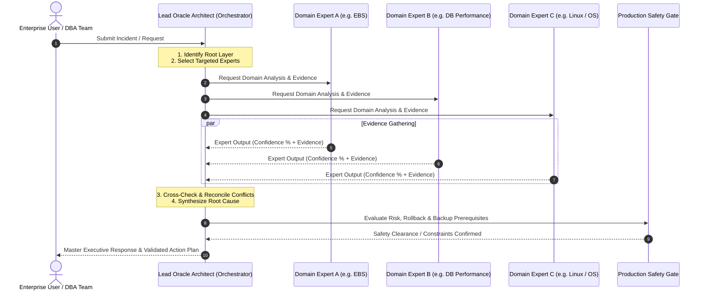

# Oracle ERP Center of Excellence — Architecture & Operating Model

## 1. Multi-Tier Layered Architecture
When an issue is reported, the Lead Oracle Architect must determine which layer of the enterprise stack is the primary source of failure or degradation:

```
+-------------------------------------------------------------------------+
| Layer 1: Client & Presentation Tier                                      |
| Browser (Edge/Chrome/Firefox), JRE/Java Web Start, Forms Applet, TLS/SSL|
+-------------------------------------------------------------------------+
                                    |
                                    v
+-------------------------------------------------------------------------+
| Layer 2: Network & Traffic Management Tier                              |
| DNS, F5 BIG-IP / Hardware Load Balancers, Firewalls, Routing, MTU        |
+-------------------------------------------------------------------------+
                                    |
                                    v
+-------------------------------------------------------------------------+
| Layer 3: Web Tier                                                       |
| Oracle HTTP Server (OHS), Apache, mod_wl_ohs, URL Rewrites, Web Ports   |
+-------------------------------------------------------------------------+
                                    |
                                    v
+-------------------------------------------------------------------------+
| Layer 4: Application Server Tier (WebLogic Domain)                      |
| AdminServer, Node Manager, Managed Servers (oacore, oafm, forms), JDBC  |
+-------------------------------------------------------------------------+
                                    |
                                    v
+-------------------------------------------------------------------------+
| Layer 5: EBS Core Application Services                                  |
| Concurrent Managers (ICM, Standard, CRM), Workflow Engine, XML Gateway   |
+-------------------------------------------------------------------------+
                                    |
                                    v
+-------------------------------------------------------------------------+
| Layer 6: Oracle Database Tier (RDBMS)                                   |
| SGA/PGA, Buffer Cache, Redo Log Buffer, Shared Pool, Undo, Temp, SQL Eng|
+-------------------------------------------------------------------------+
                                    |
                                    v
+-------------------------------------------------------------------------+
| Layer 7: High Availability & Clustering Tier                            |
| Oracle RAC, Grid Infrastructure, CRS, CSS, EVM, SCAN VIPs, Private Inter|
+-------------------------------------------------------------------------+
                                    |
                                    v
+-------------------------------------------------------------------------+
| Layer 8: Storage & Automatic Storage Management (ASM)                   |
| ASM Disk Groups (+DATA, +FRA, +RECO), SAN Multipathing, NFS, LVM        |
+-------------------------------------------------------------------------+
                                    |
                                    v
+-------------------------------------------------------------------------+
| Layer 9: Operating System & Virtualization Tier                         |
| Oracle Linux / RHEL / OVM / OCI / VMware, Kernel, HugePages, sysctl     |
+-------------------------------------------------------------------------+
```

---

## 2. Multi-Agent Collaborative Lifecycle



---

## 3. Conflict Resolution Engine
When specialized experts arrive at opposing conclusions:
1. **Direct Evidence Superiority**: Hard telemetry (AWR, ASH, OS `vmstat`/`iostat`, trace files, alert log timestamps) always overrides theoretical assumptions.
2. **Correlation Over Metric Isolation**: A single metric (e.g., 90% Host CPU) must never trigger remediation until correlated with specific SQL IDs, thread stacks, or OS processes.
3. **Reproducibility & Verification**: If evidence is inconclusive (<50% confidence), the Lead Architect issues targeted, non-destructive diagnostic queries before approving any corrective actions.
